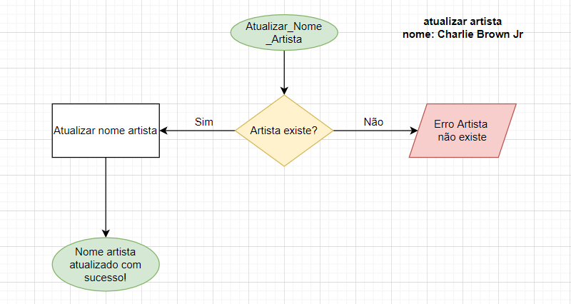
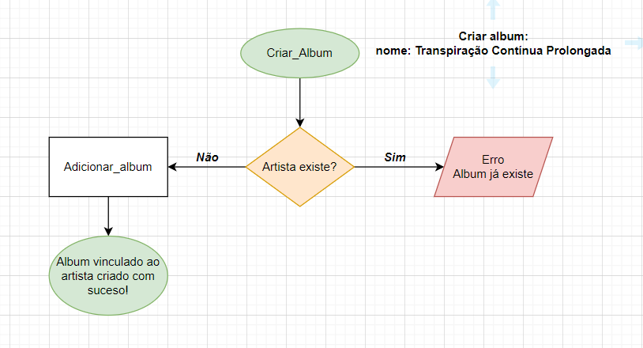
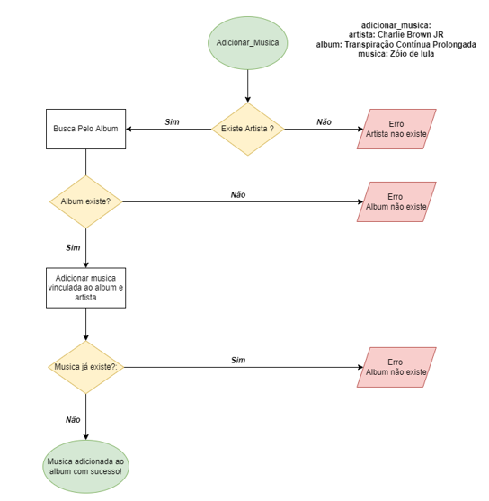
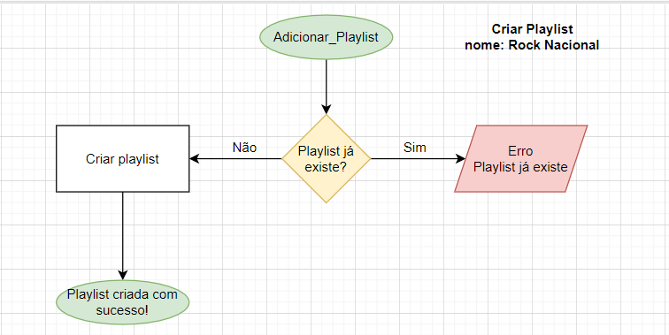
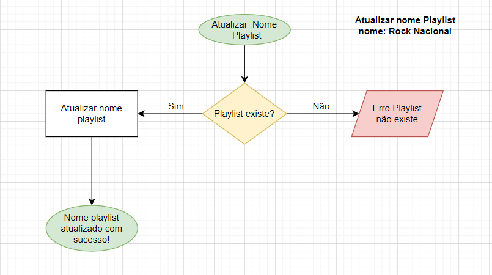
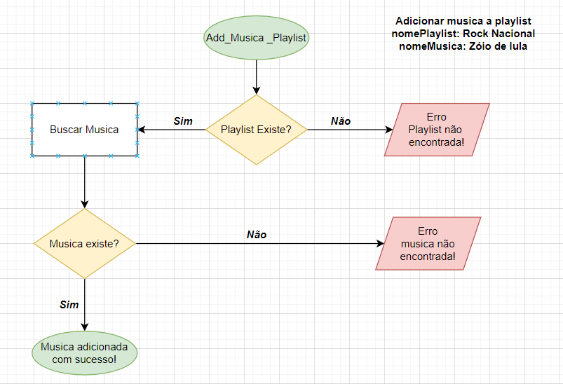
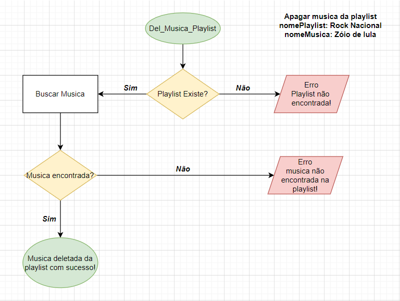
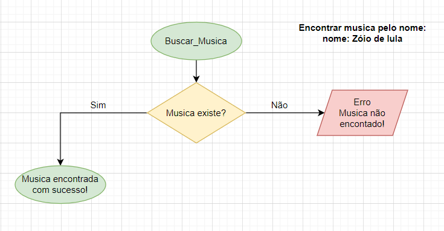
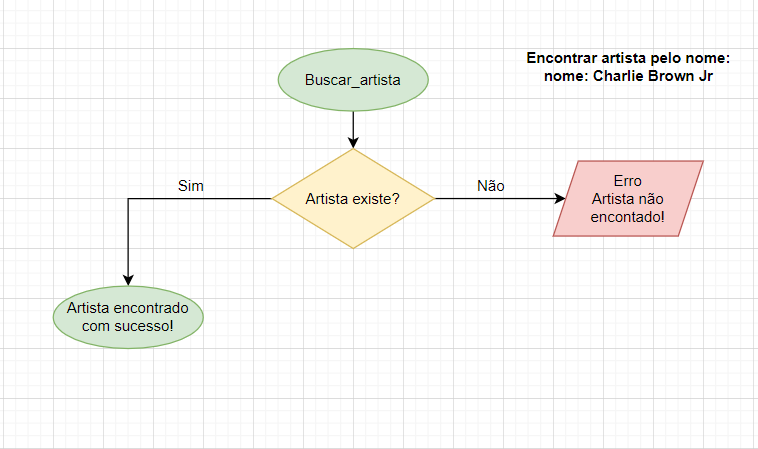

<h2> Sobre </h2>

O projeto é um desafio back-and da **Beca Java - NTT DATA BRASIL**. 
 Uma versão bem simploria do tão querido Spotify. 
O projeto foi dividido em 8 partes que estão descritas em cada desafio.

<h2> 📖 Sumário </h2>

<li>  O que é possível fazer</li>
<li>  Lista dos desafios</li>
<li>  Tecnologias utilizadas</li>
<li>  Resumo dos desafios</li>
<li>  Considerações finais</li>
<li>  Diagrama</li>
<li>  Fluxogramas</li>

<h2> 💡 O que é possível fazer</h2>
<li> Pesquisar músicas</li>
<li>  Pesquisar artistas</li>
<li>  Pesquisar coletanias</li>
<li>  Criar sua propria playlist</li>

<h2>📑 Lista de desafios</h2>
<li> <a href= "https://github.com/almeidaguil/becaDesafioGuilherme/tree/desafio1"> Desafio 1</a> </li>
<li> <a href= "https://github.com/almeidaguil/becaDesafioGuilherme/tree/desafio2"> Desafio 2</a> </li>
<li> <a href= "https://github.com/almeidaguil/becaDesafioGuilherme/tree/Desafio3"> Desafio 3</a> </li>
<li> <a href= "https://github.com/almeidaguil/becaDesafioGuilherme/tree/Desafio4"> Desafio 4</a> </li>
<li> <a href= "(https://github.com/almeidaguil/becaDesafioGuilherme/tree/Desafio5"> Desafio 5</a> </li>
<li> <a href= "https://github.com/almeidaguil/becaDesafioGuilherme/tree/Desafio6"> Desafio 6</a> </li>
<li> <a href= "https://github.com/almeidaguil/becaDesafioGuilherme/tree/Desafio7"> Desafio 7</a> </li>
<li> <a href= "https://github.com/almeidaguil/becaDesafioGuilherme/tree/Desafio8"> Desafio 8</a> </li>

<h2> 🛠 Tecnologias utilizadas</h2>
<li> IntelliJ IDEA</li>
<li>  Spring Boot</li>
<li>  Linguagem Java</li>
<li>  Postman</li>
<li>  Banco de dados H2</li>
<li>  Banco de dados MySql</li>

<h2> 📃 Resumo dos desafios</h2>
<h3>🎯Desafio 1: </h3>
<li>  Criar um projeto Spring Boot, implementar classes base da API;</li>
<li>  Criar um repositório no git onde será feita a entrega dos desafios;</li>
<li>  Fazer commit na brach "main" junto com o Readme.md.</li>

<i>O objetivo durante o desafio 1 é entender o conceito de POO, criar uma modelagem e um 
pequeno resumo sobre o que será a API, ter o primeiro contato com o Spring Boot e github.</i> 

<h3>🎯Desafio 2: </h3>
<li>  Criar classes <b>controllers</b> (<i>CRUD</i>);</li>
<li> Implementar <b>OpenAPI</b> na <b>Spring Rest API</b>;</li>
<li> Implementar <b>ResponseEntity</b> para retorno das chamadas.</li>

<i>O objetivo durante o desafio 2 é entender o conceito de CRUD(Create, Read, Update, Delete) e como 
utilizar e o ResponseEntity dentro de uma aplicação.</i>

<h3>🎯Desafio 3: </h3>
<li>  Criar classe(s) de <b>serviço(s)</b>;</li>
<li>  Implementar <b>interfaces</b> e declarar métodos que irá utilizar;</li>
<li>  Fazer a integração com as camadas <b>controllers</b>.</li>

<i>O Objetivo durante o desafio 3 é entender o conceito de serviços e interfaces, como fazer a utilização
e implementação de ambos além de facilitar futuras atualizações em seu projeto.</i>

<h3>🎯Desafio 4: </h3>
<li>  Criar classe(s) de <b>repository</b>;</li>
<li>  Configurar <b>banco de dados H2</b>;</li>
<li>  Implementar na(s) camada(s) de <b>serviço(s)</b>;</li>
<li>  Fazer <b>testes</b> para certificar a integridade da base de dados.</li>

<i>O objetivo durante o desafio 4 é conhecer a classe repository e como integra-lá dentro de uma API,
além de ter um primeiro contato com um banco de dados em memória e testar a integridade dos dados 
inseridos.</i>

<h3>🎯Desafio 5: </h3>
<li>  Aplicar conceito de <b>DTO</b>(Data Transfer Object);</li>
<li>  Fazer relacionamento das tabelas da API;</li>
<li> Criar end-point para retornar um DTO personalizado.</li>

<i>O objetivo durante o desafio 5 é entender o conceito de DTO e como fazer o relacionamento entre tabelas
diferentes dentro da sua API com o intuito de retornar informações personalizadas durante os testes.</i>

<h3>🎯Desafio 6: </h3>
<li>  Adicionar validações de dados; </li>
<li>  Adicionar <b>Mapper</b> para conversão de objetos;</li>
<li>  Implementar <b>Lombok</b>;</li>

<i>O objetivo durante o desafio 6 é criar validação de dados, entender o conceito e utilização de Mappers,
além de conhecer a anotação @Lombok para um código mais limpo e simplificado.</i>

<h3>🎯Desafio 7: </h3>
<li>  Fazer tratamento de erros utilizando <b>try catch</b> e se necessário <b>finaly</b>;</li>
<li>  Fazer tratamento de eros utilizando <b>throw</b> e <b>@ExceptionHandler</b>;</li>
<li>  Criar classe para tratamento de erros utilizando <b>@ControllerAdvice</b>;</li>
<li>  Fazer testes para verificar se o resultado dos erros é o esperado.</li>

<i>O objetivo do desafio 7 é aprofundar o conhecimento em tratamento de erros que tenham retorno
de forma customizadas para facilitar o entendimento dos mesmo. Utilizando thy catch para um erro 
condicional, @ExceptionHandler para retorno de mensagem explicativa do erro e o @ControllerAdvice
para ter uma forma mais clara e objetiva com a mensagem do erro.</i>

<h3>🎯Desafio 8: </h3>
<li>  Criar um <b>docker-compose.yml</b>;</li>
<li>  Criar um <b>container</b> contendo a nova base de dados;</li>
<li>  Integrar a API com a base de dados;</li>
<li>  Fazer testes de integração com a base de dados;</li>

<i>O objetivo do desafio 8 é aprofundar o conhecimento em banco de dados e integração com uma
base dados mais fiel as usadas em aplicações reais. Uma das funções do Docker é poder definir um comportamento
caso um container apresente falhas.</i>

<h3>🙌Considerações finais: </h3>
<i>A ideia é do mentor <b>Flavius Gama</b>, pessoa que me ajudou muito
nas dificuldades que tive pelo caminho até a conclusão. Deixo aqui expresso meus agradecimentos
pelo seu tempo e paciência que teve com seus mentorados.  
Tiveram algumas partes bem desafiadoras, onde travei, mas corri atrás de ajuda para conseguir
conclui-lo. Foram muitos aprendizados nessa caminhada, sei que ainda tenho muito a
aprender, mas até aqui me sinto satisfeito. Guardarei esse projeto com
muito carinho e futuramente espero voltar aqui e melhora-lo.</i>

<h2> Diagrama</h2>
Modelo conceitual

<h2>👨‍🔧 Fluxogramas ADMIN:</h2>

Adicionar novo artista:

Atualizar nome de artista existente:

Criar álbum (vinculado ao artista já existente):

Adicionar música (vinculada a álbum já existente):

<h2>🧔 Fluxogramas USER:</h2>

Criar playlist:
<

Atualizar nome da playlist existente:

Adicionar música a uma playlist existente:

Deletar uma música playlist:

Buscar se uma música existe no BD:

Buscar se um artista existe no BD:

